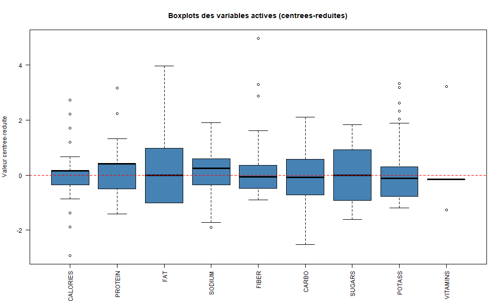
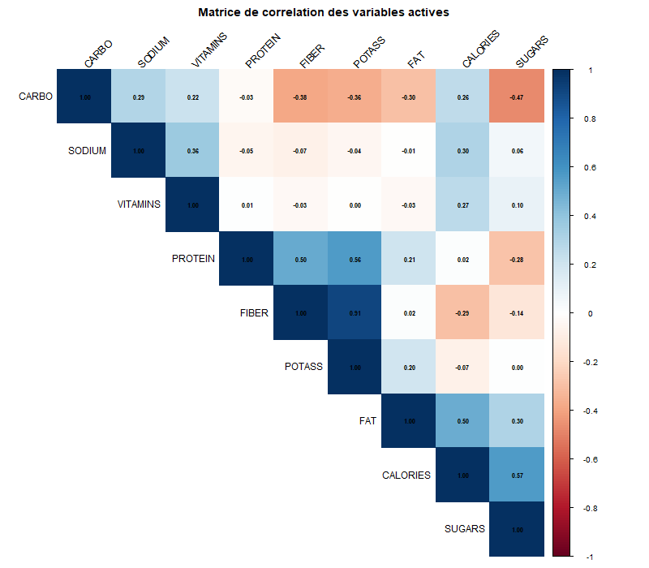
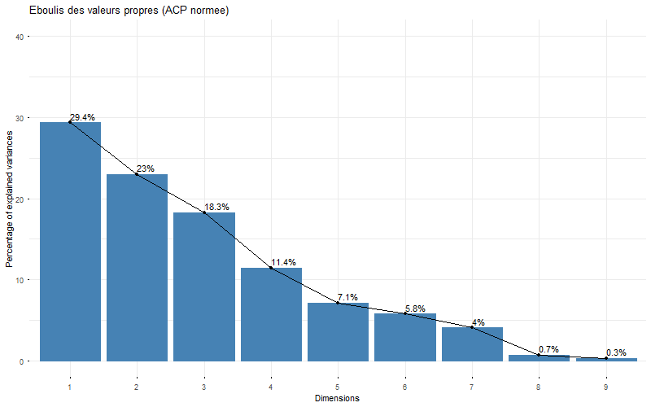
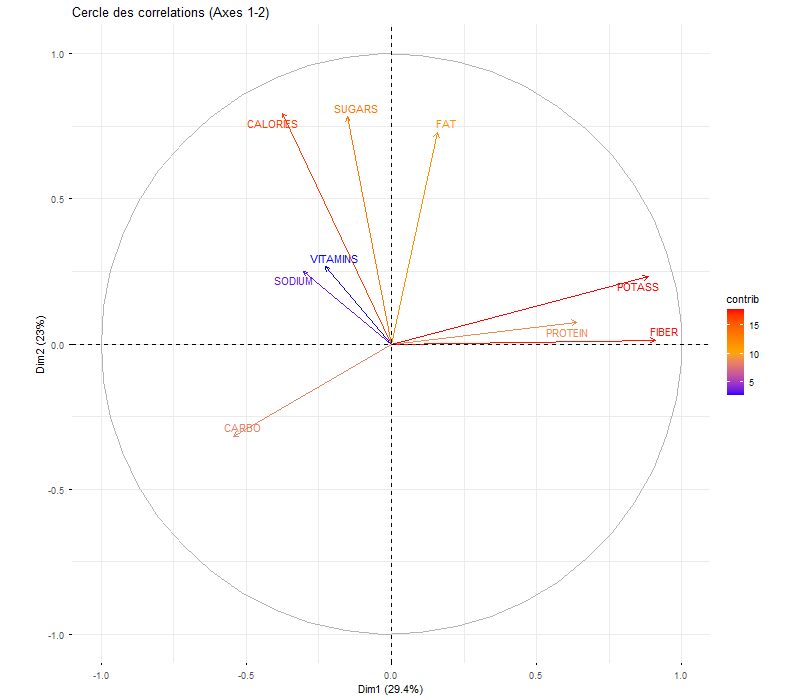
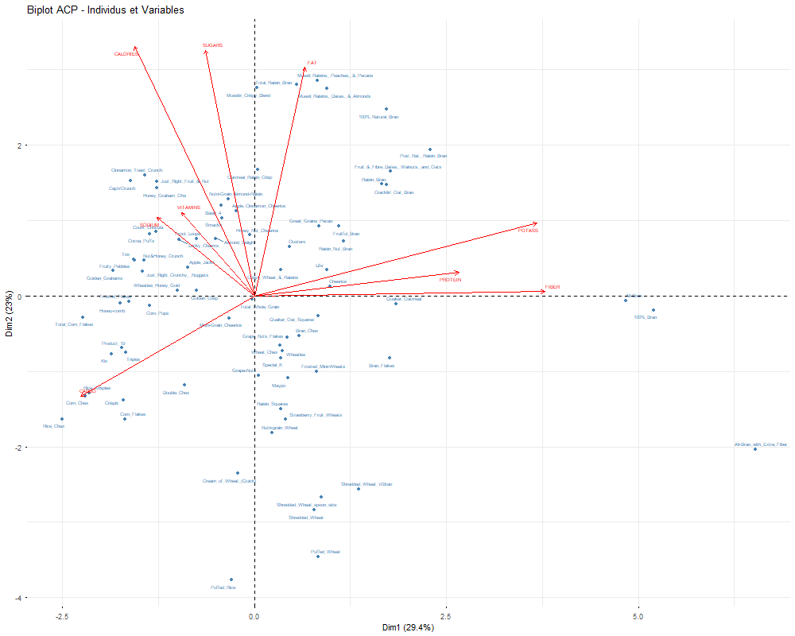
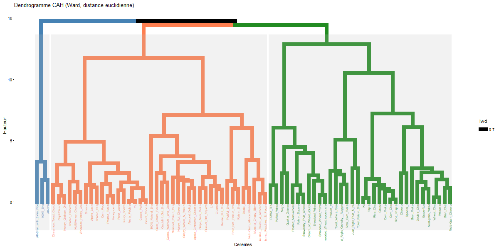
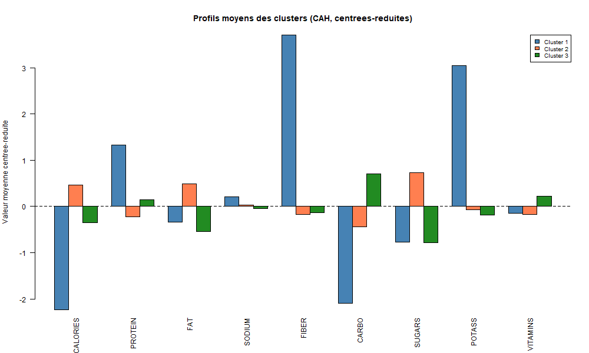
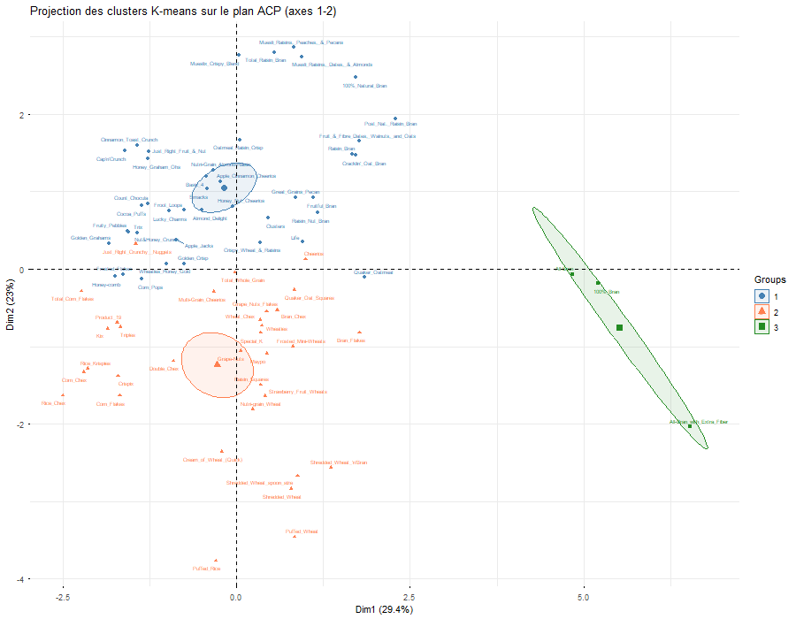
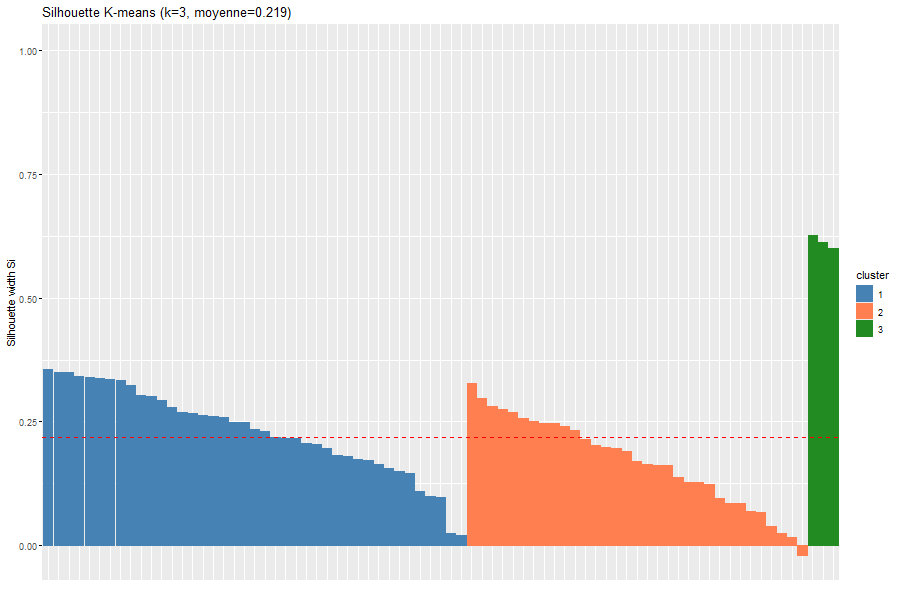
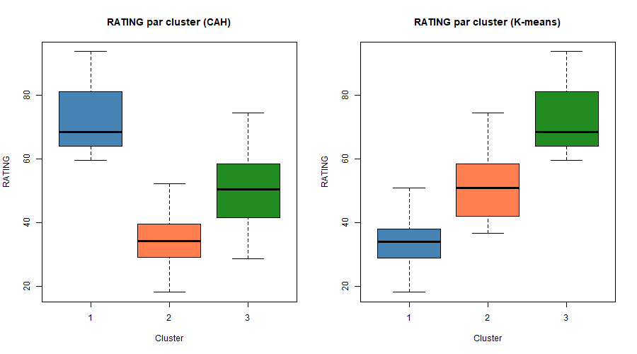

```{r setup, include=FALSE}
knitr::opts_chunk$set(echo=FALSE, warning=FALSE, message=FALSE,
                      fig.pos="H", fig.align="center",
                      out.width="85%")
library(FactoMineR)
library(factoextra)
library(corrplot)
library(cluster)
```

# Introduction

Ce rapport presente l'analyse d'un jeu de donnees portant sur 77 cereales de petit-dejeuner commercialisees aux Etats-Unis. L'objectif est de comprendre comment ces cereales se differencient sur le plan nutritionnel, et si on peut identifier des groupes homogenes parmi elles.

On dispose de 16 variables par cereale : des informations nutritionnelles (calories, proteines, graisses, etc.), des variables de conditionnement (poids, taille de portion), et des metadonnees (fabricant, type de consommation, note de satisfaction). Les variables sont mesurees dans des unites tres differentes (Kcal, grammes, milligrammes, note sur 100), ce qui oriente directement le choix des methodes.

L'approche retenue combine une ACP normee pour reduire la dimensionnalite et visualiser les relations entre variables, suivie de deux methodes de classification (CAH et K-means) pour regrouper les cereales en profils nutritionnels distincts.


# Description des donnees

## Presentation du jeu de donnees

Le fichier `276-cereals.txt` contient 77 cereales decrites par 16 variables. Apres examen de la structure, on distingue trois types de variables :

- **Identifiant** : NAME (nom de la cereale)
- **Variables qualitatives** : MANUF (fabricant, 7 modalites : A, G, K, N, P, Q, R) et TYPE (C = consommation froide, H = chaude)
- **Variables quantitatives** (13) : CALORIES, PROTEIN, FAT, SODIUM, FIBER, CARBO, SUGARS, POTASS, VITAMINS, SHELF, WEIGHT, CUPS, RATING

La repartition est desequilibree : 74 cereales froides contre seulement 3 chaudes. Les fabricants Kellogg's (K, 23 cereales) et General Mills (G, 22) dominent le jeu de donnees.

## Pretraitement

Certaines valeurs sont codees -1 dans le fichier original. Apres verification, il s'agit de donnees manquantes (une valeur negative n'a pas de sens pour des contenus nutritionnels). On a identifie 4 valeurs manquantes : 2 pour POTASS, 1 pour CARBO, 1 pour SUGARS.

On a choisi de les imputer par la mediane de chaque variable. La mediane est plus robuste que la moyenne face aux valeurs extremes, ce qui est pertinent ici puisque certaines variables comme FIBER ou POTASS presentent des distributions tres asymetriques.

## Definition des roles pour l'ACP

Pour l'ACP, on a selectionne 9 variables actives correspondant aux caracteristiques nutritionnelles pures : CALORIES, PROTEIN, FAT, SODIUM, FIBER, CARBO, SUGARS, POTASS et VITAMINS.

Les variables SHELF, WEIGHT, CUPS et RATING sont traitees comme variables supplementaires quantitatives : elles ne participent pas a la construction des axes mais sont projetees a posteriori pour enrichir l'interpretation. MANUF et TYPE sont des variables supplementaires qualitatives.

Ce choix se justifie : WEIGHT et CUPS decrivent le conditionnement, pas la composition nutritionnelle. RATING est une note calculee par Consumer Reports, donc une variable derivee qu'on prefere analyser en supplementaire pour voir comment elle se positionne par rapport aux axes nutritionnels.


# Statistiques descriptives

## Analyse univariee

```{r load-data}
load("output/cereales_clean.RData")
```

Le tableau ci-dessous resume les principales statistiques des variables actives :

```{r summary-table}
library(moments)
vars_actives <- c("CALORIES","PROTEIN","FAT","SODIUM","FIBER","CARBO","SUGARS","POTASS","VITAMINS")
forme <- data.frame(
  Moyenne   = round(sapply(cereales[,vars_actives], mean), 1),
  Mediane   = round(sapply(cereales[,vars_actives], median), 1),
  Ecart.type = round(sapply(cereales[,vars_actives], sd), 1),
  Skewness  = round(sapply(cereales[,vars_actives], skewness), 2)
)
knitr::kable(forme, caption="Statistiques des variables actives")
```

Quelques constats : FIBER (skewness = 2.38) et VITAMINS (2.42) sont tres asymetriques a droite, ce qui signifie que la plupart des cereales ont peu de fibres et de vitamines, avec quelques exceptions notables. SUGARS est a peu pres symetrique (skewness = 0.04), les cereales se repartissent assez uniformement entre peu et tres sucrees.

```{r boxplots, fig.cap="Boxplots des variables actives (centrees-reduites)", out.width="90%"}

```

Les boxplots montrent plusieurs outliers, en particulier pour FIBER et POTASS (les cereales All-Bran) et pour VITAMINS (les cereales "Total" enrichies a 100% des apports). On conserve ces observations car elles representent de vraies cereales du marche, meme si elles sont atypiques.


## Analyse bivariee

```{r heatmap, fig.cap="Matrice de correlation des variables actives", out.width="80%"}

```

La matrice de correlation revele une structure interessante. La correlation la plus forte est entre FIBER et POTASS (r = 0.91). Ce lien est logique d'un point de vue nutritionnel : les cereales completes riches en fibres conservent les mineraux du grain, dont le potassium. On note aussi que CALORIES est correle positivement a SUGARS (r = 0.57) et FAT (r = 0.50), ce qui reflete simplement le fait que sucres et graisses sont des sources caloriques.

CARBO est correle negativement a SUGARS (r = -0.47), ce qui peut sembler contre-intuitif. En fait, les cereales riches en glucides complexes (amidon) sont souvent moins sucrees : les sucres simples remplacent l'amidon, pas s'y ajoutent.

L'existence de ces correlations justifie le recours a l'ACP : les 9 variables ne sont pas independantes, et une reduction de dimension permettra de mieux visualiser cette structure.


# Analyse en composantes principales

## Choix de l'ACP normee

Les variables etant mesurees dans des unites differentes (Kcal, grammes, milligrammes, note), une ACP non normee donnerait un poids disproportionne aux variables a forte variance comme SODIUM (ecart-type = 84) ou POTASS (ecart-type = 69) par rapport a FAT (ecart-type = 1). L'ACP normee, qui travaille sur la matrice de correlation apres centrage-reduction, traite toutes les variables de maniere equitable.

## Valeurs propres et nombre d'axes

```{r scree, fig.cap="Eboulis des valeurs propres", out.width="75%"}

```

```{r acp-load}
load("output/res_acp.RData")
eig <- res_acp$eig
```

Le critere de Kaiser (valeurs propres > 1) conduit a retenir 4 axes, qui captent 82.1% de l'inertie totale. Les deux premiers axes concentrent a eux seuls 52.4% de l'information, ce qui est correct pour 9 variables. Le scree plot ne montre pas de coude tres marque, mais une decroissance progressive. On se concentrera sur le plan factoriel (1,2) pour les interpretations principales, en gardant a l'esprit que les axes 3 et 4 portent encore de l'information non negligeable.


## Cercle des correlations

```{r cercle, fig.cap="Cercle des correlations (axes 1-2)", out.width="80%"}

```

L'axe 1 (29.4% d'inertie) est principalement construit par FIBER et POTASS du cote positif. C'est un axe qu'on peut interpreter comme un gradient de "richesse en fibres". Les cereales a droite du plan sont riches en fibres et en potassium, celles a gauche en sont pauvres.

L'axe 2 (23.0%) oppose CALORIES, FAT et SUGARS (en haut) a un pole plus neutre (en bas). C'est un axe de "densite calorique" : les cereales en haut du plan sont plus caloriques, plus grasses et plus sucrees.

On remarque que SODIUM et VITAMINS sont mal representes sur ce plan (vecteurs courts), ce qui confirme que les axes 3 et 4 capturent l'information de ces variables. CARBO est dans le cadran bas-gauche, oppose a SUGARS : cela confirme l'opposition glucides complexes / sucres simples vue dans les correlations.


## Carte des individus et biplot

```{r biplot, fig.cap="Biplot - individus et variables", out.width="85%"}

```

Le biplot permet de voir les cereales et les variables en meme temps. Les trois cereales All-Bran (100% Bran, All-Bran, All-Bran with Extra Fiber) sont clairement isolees a droite, du cote des fibres. A l'oppose, on trouve Rice Chex, Corn Chex et d'autres cereales a base de riz ou mais, pauvres en fibres.

En haut du plan, les cereales sucrees (Cap'n'Crunch, Froot Loops, Lucky Charms) s'alignent avec les vecteurs SUGARS et CALORIES. En bas, les cereales peu caloriques comme Puffed Rice ou Shredded Wheat.

## Variables supplementaires

La variable RATING se projette avec une coordonnee positive sur l'axe 1 (+0.62) et negative sur l'axe 2 (-0.72). Autrement dit, les cereales bien notees par Consumer Reports sont celles riches en fibres et pauvres en calories/sucres. La note reflete donc assez fidelement la "qualite nutritionnelle" telle que definie par les axes de l'ACP.

Pour les fabricants, Nabisco (N) se positionne clairement dans le quadrant "fibres elevees, peu caloriques", ce qui est coherent avec leur gamme Shredded Wheat. General Mills (G) et Kellogg's (K) occupent des positions plus centrales, avec des gammes variees.

Les cereales chaudes (H, 3 seulement) se projettent a l'ecart des froides, mais l'effectif est trop faible pour en tirer des conclusions solides.


# Classification

## CAH - Methode de Ward

```{r dendrogramme, fig.cap="Dendrogramme (CAH, Ward, distance euclidienne)", out.width="95%"}

```

On applique la CAH avec la distance euclidienne sur les donnees centrees-reduites et le critere de Ward, qui minimise l'augmentation d'inertie intra-classe a chaque fusion. Ce critere est coherent avec la metrique euclidienne utilisee, et tend a produire des clusters de taille comparable.

Le dendrogramme suggere une partition en 3 classes, avec un saut d'inertie visible entre 3 et 2 clusters. La silhouette moyenne pour k=3 est de 0.21, ce qui est modeste. Pour comparaison, k=2 donne une silhouette de 0.45, plus nette, mais on perd l'information sur le groupe des cereales tres riches en fibres.

```{r profils-cah, fig.cap="Profils moyens des 3 clusters (CAH, donnees centrees-reduites)", out.width="85%"}

```

Les trois clusters obtenus sont :

- **Cluster 1** (3 cereales) : profil "haute fibre". FIBER et POTASS tres eleves, CALORIES et CARBO faibles. Ce sont les trois cereales All-Bran.
- **Cluster 2** (40 cereales) : profil "sucre/calorique". SUGARS et CALORIES au-dessus de la moyenne, FIBER et CARBO en dessous.
- **Cluster 3** (34 cereales) : profil "modere". Peu de sucre, peu de gras, CARBO eleve. Ce sont des cereales de type classique (Corn Flakes, Rice Krispies, etc.).

Le cluster 1 ne contient que 3 individus, ce qui le rend fragile. Ce sont en realite des outliers nutritionnels et pas un "type" de cereale au sens commercial du terme. Mais leur separation est nette et reproductible.


## K-means

On applique le K-means avec le meme nombre de clusters (k=3) pour comparer. On utilise nstart=25 pour attenuer l'effet de l'initialisation aleatoire (l'algorithme est non deterministe, contrairement a la CAH).

```{r clusters-acp, fig.cap="Projection des clusters K-means sur le plan ACP", out.width="85%"}

```

Les clusters K-means sont tres similaires a ceux de la CAH. La projection sur le plan ACP montre une bonne separation : le cluster "haute fibre" est isole a droite, le cluster "sucre" est en haut et le cluster "modere" en bas a gauche.

## Comparaison CAH vs K-means

```{r silhouette, fig.cap="Silhouette des clusters K-means", out.width="75%"}

```

L'indice de Rand entre les deux partitions est de 0.882, ce qui indique un bon accord. La purete est de 0.935 : 93.5% des individus sont classes dans le meme groupe par les deux methodes. Les quelques divergences concernent des cereales a la frontiere entre les clusters "sucre" et "modere", ce qui est attendu puisque cette frontiere est moins nette que la separation avec le groupe haute fibre.

```{r rating-clusters, fig.cap="RATING par cluster (K-means)", out.width="65%"}

```

Le RATING moyen par cluster confirme l'interpretation : les cereales haute fibre (cluster 3) ont un RATING moyen de 73.8, contre 51.4 pour les moderees et 33.3 pour les sucrees. La note Consumer Reports penalise les cereales sucrees et valorise les cereales riches en fibres, ce qui est coherent avec les recommandations dietetiques actuelles.


# Conclusion

L'analyse du jeu de donnees "276 cereales" a permis de mettre en evidence deux axes de variabilite principaux : la teneur en fibres (et potassium associe) d'une part, et la densite calorique (calories, sucres, graisses) d'autre part. Ces deux axes suffisent a expliquer plus de la moitie de la variance totale.

La classification en 3 groupes, obtenue de maniere coherente par CAH et K-means (Rand = 0.88), distingue des cereales "sucrees/caloriques" (le groupe le plus nombreux), des cereales "moderees/classiques", et un petit groupe de cereales tres riches en fibres. Ce dernier groupe est compose uniquement de cereales All-Bran et constitue une niche nutritionnelle.

Un resultat a noter : la variable RATING (non utilisee dans la construction des axes) se projette presque parfaitement dans le plan factoriel. Elle est positivement associee aux fibres et negativement aux sucres, ce qui suggere que Consumer Reports evaluela qualite nutritionnelle selon des criteres proches de ceux identifies par l'ACP.

Une limite de cette analyse : la partition en 3 clusters a une silhouette moyenne modeste (0.22), et le groupe haute fibre ne contient que 3 individus. Une partition en 2 clusters serait plus robuste statistiquement, mais moins informative. Le choix de k=3 est un compromis entre stabilite et finesse d'interpretation.


\newpage

# Annexe : code R

Le code complet est organise en 6 scripts executables sequentiellement via `00_main.R`. Les packages utilises sont FactoMineR, factoextra, corrplot, cluster et moments.

Les scripts sont disponibles dans le dossier `scripts/` du projet :

- `01_pretraitement.R` : chargement, gestion des NA, imputation par la mediane
- `02_stats_descriptives.R` : statistiques univariees et bivariees
- `03_acp.R` : ACP normee avec FactoMineR
- `04_cah.R` : CAH (Ward, distance euclidienne)
- `05_kmeans.R` : K-means et comparaison avec la CAH
- `06_synthese.R` : projections et interpretation finale
